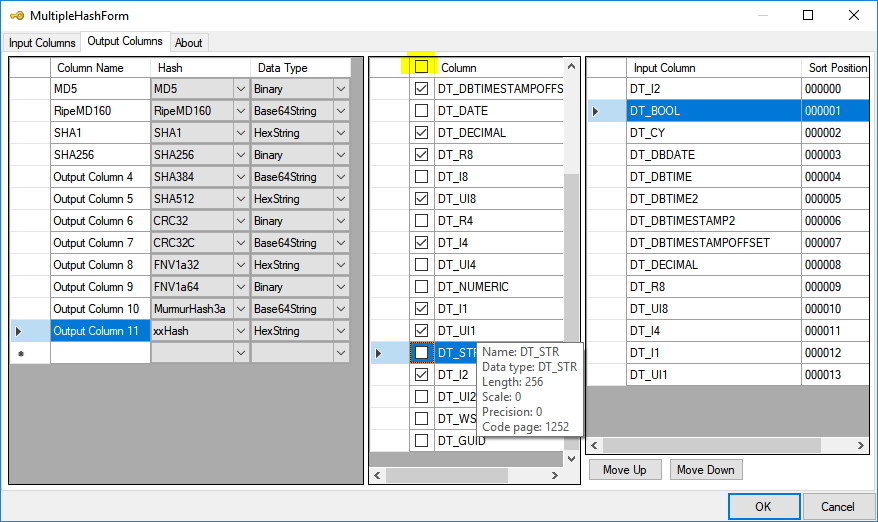

# Output Columns Tab

This tab allows you to:
* add new output columns
* rename existing output columns
* change the Hash function used on output columns
* select which input columns are used for a hash
* change the order of the input columns used for a hash

## Usage
In the Output Columns grid, select the output column (or if none entered, the first row).
Add/Change the column name
Select the Hash Function.
If you select the Hash Function first, then a column name will be auto generated for you.  I recommend changing this name to one more appropriate to your function.
Tick the columns that you want in the Hash.  These will be populated into the Rightmost grid, in the order that you select them.

If you have selected columns in the _wrong_ order, then you can use the **Move Up** and **Move Down** buttons to change the order.
 
New in 1.4.1 is the ability to highlight a number of rows in the middle list, and select/deselect them as a group.   Just ensure that you have the shift key pressed when you click in the checkbox at the bottom of your group selection.
You can also sort this list (before selecting your rows), by clicking on the header row.
Clicking on the left of the header row will highlight all the rows, to allow mass select/deselect.  Ensure that you click on the LAST row in the selection group when doing this.